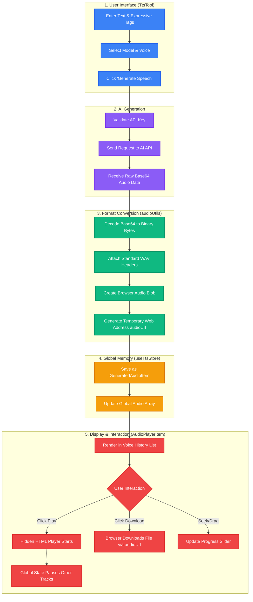

# TTS Diagram Process

```mermaid
graph TD
    %% Define Styles
    classDef ui fill:#3b82f6,stroke:#2563eb,stroke-width:2px,color:#fff;
    classDef process fill:#8b5cf6,stroke:#7c3aed,stroke-width:2px,color:#fff;
    classDef convert fill:#10b981,stroke:#059669,stroke-width:2px,color:#fff;
    classDef storage fill:#f59e0b,stroke:#d97706,stroke-width:2px,color:#fff;
    classDef interact fill:#ef4444,stroke:#dc2626,stroke-width:2px,color:#fff;

    %% 1. User Input Phase
    subgraph UI ["1. User Interface (TtsTool)"]
        A[Enter Text & Expressive Tags]:::ui --> B[Select Model & Voice]:::ui
        B --> C[Click 'Generate Speech']:::ui
    end

    %% 2. API & Generation Phase
    subgraph API ["2. AI Generation"]
        C --> D[Validate API Key]:::process
        D --> E[Send Request to AI API]:::process
        E --> F[Receive Raw Base64 Audio Data]:::process
    end

    %% 3. Audio Conversion Phase
    subgraph AudioUtils ["3. Format Conversion (audioUtils)"]
        F --> G[Decode Base64 to Binary Bytes]:::convert
        G --> H[Attach Standard WAV Headers]:::convert
        H --> I[Create Browser Audio Blob]:::convert
        I --> J[Generate Temporary Web Address audioUrl]:::convert
    end

    %% 4. State Storage Phase
    subgraph Store ["4. Global Memory (useTtsStore)"]
        J --> K[Save as GeneratedAudioItem]:::storage
        K --> L[Update Global Audio Array]:::storage
    end

    %% 5. Display & Playback Phase
    subgraph Playback ["5. Display & Interaction (AudioPlayerItem)"]
        L --> M[Render in Voice History List]:::interact
        M --> N{User Interaction}:::interact

        N -->|Click Play| O[Hidden HTML Player Starts]:::interact
        O -.-> P[Global State Pauses Other Tracks]:::interact

        N -->|Click Download| Q[Browser Downloads File via audioUrl]:::interact
        N -->|Seek/Drag| R[Update Progress Slider]:::interact
    end

```
